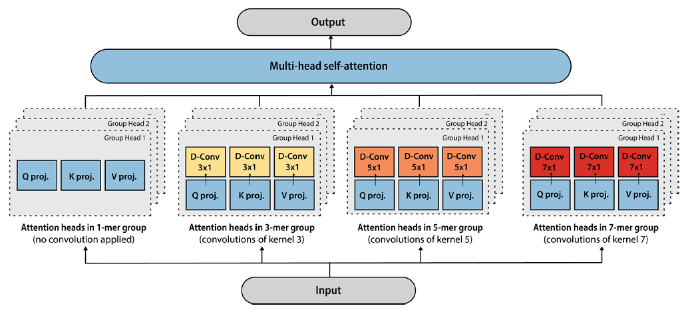

# tranception-pytorch



Implementation of Tranception, a SOTA transformer model for protein fitness prediction, in PyTorch. The official implementation of tranception can be found [here](https://github.com/OATML-Markslab/Tranception).

## Installation

```bash
$ pip install tranception-pytorch-dohlee
```

## Usage

```python
import torch
from tranception_pytorch import Tranception

# Parameters for Tranception S
num_heads = 12
num_layers = 12
embed_dim = 768
max_length = 1024

model = Tranception(
    embed_dim=embed_dim,
    num_heads=num_heads,
    num_layers=num_layers,
    max_length=max_length,
)
model = model.cuda()

x = torch.randn([1, 1000])  # batch, seq_len (encoded as integer in [0, 21], 21 for [MASK])

# Autoregressive inference
out = model.log_likelihood(x)
```

## Citation
```bibtex
@inproceedings{notin2022tranception,
  title={Tranception: protein fitness prediction with autoregressive transformers and inference-time retrieval},
  author={Notin, Pascal and Dias, Mafalda and Frazer, Jonathan and Hurtado, Javier Marchena and Gomez, Aidan N and Marks, Debora and Gal, Yarin},
  booktitle={International Conference on Machine Learning},
  pages={16990--17017},
  year={2022},
  organization={PMLR}
}
```
